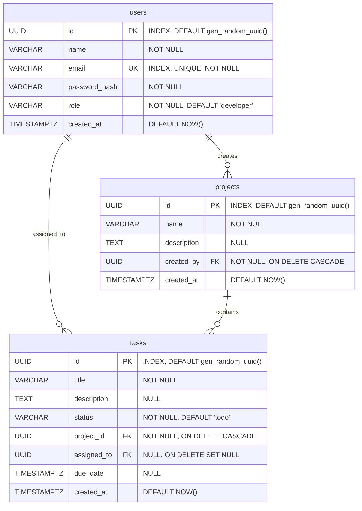

# TaskFlow — Mini Project Management System

TaskFlow is a production-style, full-stack **Project and Task Management Dashboard** built with **FastAPI (Python) + Next.js + PostgreSQL**. 

This system enforces strict **Role-Based Access Control (RBAC)** between **Admins** and **Developers**:
- **Admin**: Full access. Can create/view users, create/update/delete projects, and create/assign/transition all tasks.
- **Developer**: Restricted access. Can view projects, search/filter/list tasks, and update the status of tasks *only* if they are directly assigned to them.

---

## 🏗️ Architecture Design

TaskFlow uses a **Layered Clean Architecture** pattern on the backend to enforce modular separation of concerns and maintainability:

```
                  +--------------------------------+
                  |         Next.js Client         |
                  +---------------+----------------+
                                  |
                            REST API / JWT
                                  |
                                  v
                  +--------------------------------+
                  |     FastAPI Backend (API)      |  <-- Routing & Req Validation
                  +---------------+----------------+
                                  |
                                  v
                  +--------------------------------+
                  |      Service Layer (Business)  |  <-- Transaction management & RBAC
                  +---------------+----------------+
                                  |
                                  v
                  +--------------------------------+
                  |      Repository Layer (DB)     |  <-- Query isolation (Joinedload)
                  +---------------+----------------+
                                  |
                                  v
                  +--------------------------------+
                  |          PostgreSQL            |  <-- Relational Schema
                  +--------------------------------+
```

1. **API Layer (`app/api/`)**: Defines FastAPI routes, request-response mappings, and authentication dependencies.
2. **Service Layer (`app/services/`)**: Implements core business logic, transaction isolation levels, and permission filters.
3. **Repository Layer (`app/repositories/`)**: Abstracts raw database operations using SQLAlchemy ORM (e.g., eager-loading via joinedload to prevent N+1 issues).
4. **Model/Schema Layer (`app/models/` & `app/schemas/`)**: Defines database structures (SQLAlchemy) and input-output data validation constraints (Pydantic).

---

## 📊 Database ER Diagram

The PostgreSQL database schema consists of three primary tables: `users`, `projects`, and `tasks`.



---

## 🚀 Getting Started

### 🐳 Option A: Running with Docker Compose (Recommended)
You can launch the entire stack (PostgreSQL, FastAPI, and Next.js) with a single command. 

1. Clone or extract the project directory.
2. Run the following command in the root folder:
   ```bash
   docker compose up --build
   ```
3. Once running:
    - **Frontend Dashboard**: [http://localhost:3000](http://localhost:3000)
    - **FastAPI API Swagger Docs**: [http://localhost:8000/docs](http://localhost:8000/docs)
    - **Adminer Database Manager**: [http://localhost:8080](http://localhost:8080) (Select System: `PostgreSQL`, Server: `db`, Username: `postgres`, Password: `postgrespass`, Database: `taskflow`)
    - **PostgreSQL Database Port**: `5432`

---

### 💻 Option B: Running Locally (Manual)

#### 1. Database (PostgreSQL)
Ensure you have a PostgreSQL database instance running, then copy `.env.example` to `.env` and fill in your connection URI details.

#### 2. Backend (FastAPI)
1. Navigate to the backend directory:
   ```bash
   cd backend
   ```
2. Create and activate a virtual environment:
   ```bash
   python -m venv .venv
   # Windows:
   .\.venv\Scripts\activate
   # Linux/macOS:
   source .venv/bin/activate
   ```
3. Install dependencies:
   ```bash
   pip install -r requirements.txt
   ```
4. Run Alembic migrations:
   ```bash
   alembic upgrade head
   ```
5. Seed database with default admin/developer accounts:
   ```bash
   python app/db/seed.py
   ```
6. Start the server:
   ```bash
   uvicorn app.main:app --reload --port 8000
   ```

#### 3. Frontend (Next.js)
1. Navigate to the frontend directory:
   ```bash
   cd ../frontend
   ```
2. Install npm packages:
   ```bash
   npm install
   ```
3. Run the Next.js development server:
   ```bash
   npm run dev
   ```

---

## 🔐 Default Demo Accounts

On startup (or running the seed script), the backend registers the following users automatically:

| User Role | Email | Password | Permissions |
| :--- | :--- | :--- | :--- |
| **Admin** | `admin@taskflow.com` | `AdminPass123!` | Create Projects, Create Users, Create & Assign Tasks |
| **Developer** | `dev@taskflow.com` | `DevPass123!` | Read Projects, Read Tasks, Update status on their tasks |

---

## 📡 API Documentation Summary

For complete interactive endpoint details, visit `/docs` (Swagger UI). All endpoints except `/login` require a bearer token header: `Authorization: Bearer <JWT_TOKEN>`.

### Authentication
- `POST /api/v1/auth/login`: Authenticate email and password. Returns JWT token and User info.

### Users
- `POST /api/v1/users/`: Register new user (*Admin only*).
- `GET /api/v1/users/`: List users.

### Projects
- `POST /api/v1/projects/`: Create a new project (*Admin only*).
- `GET /api/v1/projects/`: List all projects.
- `GET /api/v1/projects/{id}`: Fetch project details.
- `PUT /api/v1/projects/{id}`: Modify project details (*Admin only*).
- `DELETE /api/v1/projects/{id}`: Delete project and cascade-delete tasks (*Admin only*).

### Tasks
- `POST /api/v1/tasks/`: Create new task (*Admin only*).
- `PUT /api/v1/tasks/{id}/assign`: Assign task to a user (*Admin only*).
- `PUT /api/v1/tasks/{id}/status`: Update status (`todo`, `in_progress`, `review`, `done`).
  - *Developer can only update if task is assigned to them.*
- `GET /api/v1/tasks/`: List tasks with query filtering and pagination.
  - **Query Params**: `project_id`, `status`, `assigned_to`, `page` (default 1), `limit` (default 10).

---

## 🧪 Running Unit & Integration Tests

The backend includes a comprehensive testing suite utilizing `pytest` running against an isolated SQLite test database.

To execute tests, navigate to the `backend/` folder and run:
```bash
python -m pytest
```
All tests check JWT validation, repository operations, transaction rollbacks during assignment errors, and RBAC filters.
